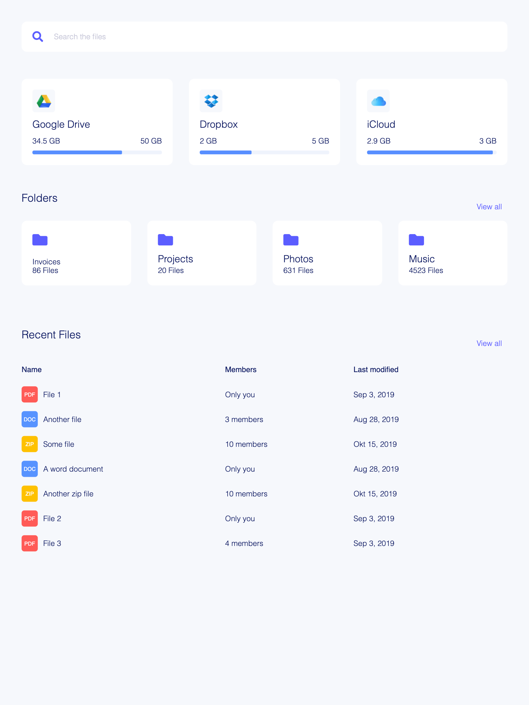

## Building and running on localhost

## Getting started

1. Clone repository
2. In exercises/04-async:
3. Run `npm install`
4. Run `npm start`

## Assignment

### DOM & jQuery

1. Render the table dynamically with JavaScript, sort by last modified.

2. Implement the Search box. When the user starts typing show a list of 5 matching files in a dropdown.

